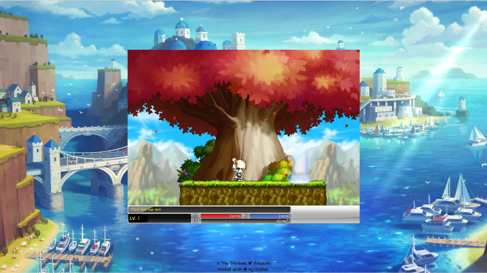

#  __**MapleStory**__ ( JS )

A 2D game using HTML5 and JS.

**NOTICE**: I'm working on the algorithms first and maybe i will update some of the shit.

## Description
A game inspired from Nexon's MapleStory.

``This game may be not so cool, there are also some bugs, especially in the loading scene, if the progress stay a long time, please refresh. If I have time, I will recontruct it.``

**demo**: [here](https://gq33352190hf8110.github.io/maplestory).

**__Status__**: __**``still in development.``**__

## How to Play
- **Dirction key:** move
- **S:** pick up
- **spacebar:** jump
- **F, G, R, T:** skills
- **Ctrl, Shift:** HP and MP regen
- **2, 3, 4:** items, ability, equipment

## Screenshots

###### Copyrights (C) The Thirteen ♥ 2018
###### All copyrights are in their respective owner's.
###### Credits: NEXON's company for their materials/ideas.